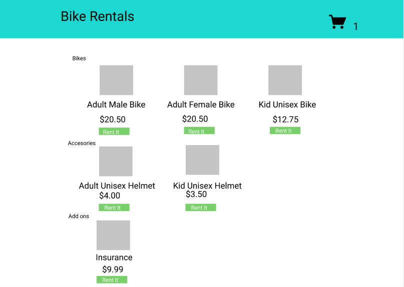
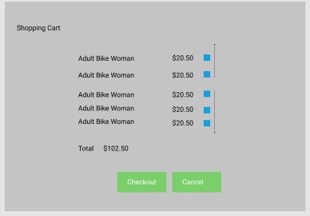

BIKE RENTALS 
===

<h2>Product Reservation Page</h2>
Simple mobile responsive Front end e-Commerce page that allows users to rent a bike along with bike accesories and insurance. Item selected upon clicking "Rent It" button validates the user's selection. Users may then proceed to checkout by clicking the displayed cart on the top right corner. Upon clicking the cart, a list of items,item price and total price display to the screen.  Cart also allows user to unselect an item from their cart.

<h2>Screenshots</h2>

Deskop view:

Shopping Cart:

Mobile View:

<!--  

 -->

<h2>Installation</h2>
npm install to download necessary packages if project is cloned

<h2>Built With </h2>
React, Bootstrap, Reactstrap, Figma

<h2>Author</h2>
Jennifer Perez
